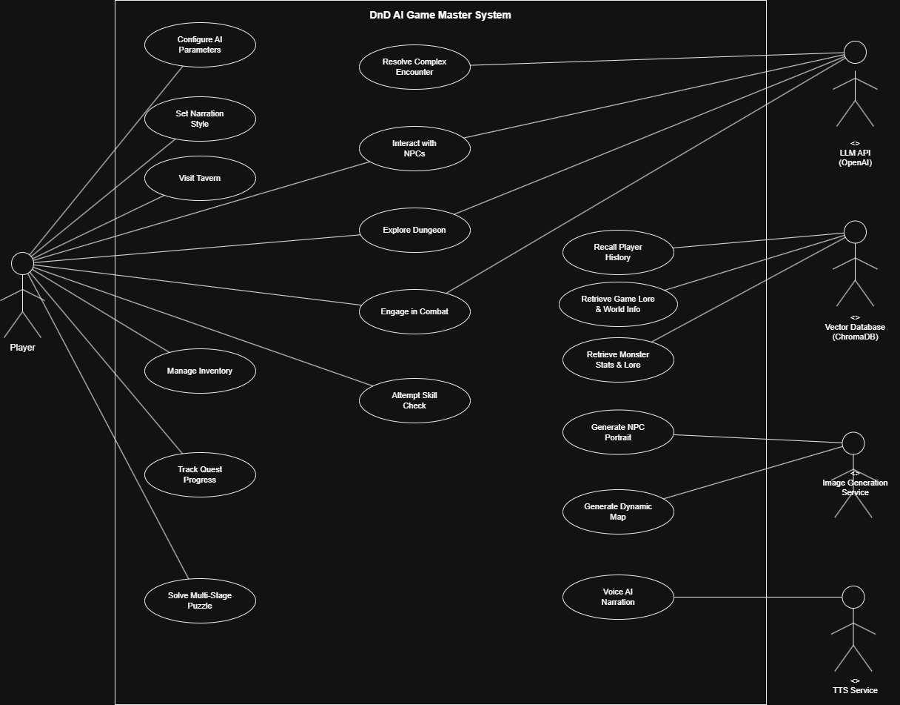
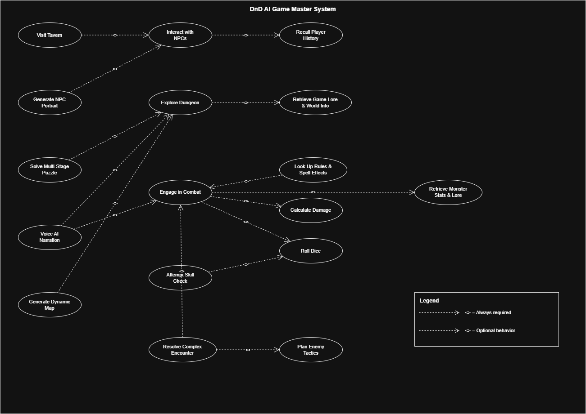

# Lab 14: Project Feature Submission

## Project: DnD AI Game Master

## Use Case Diagram

### Diagram 1 — Core Elements (Actors, Use Cases, Associations)



### Diagram 2 — Relationships (Include & Extend)



## Completed Use Cases

### 1. Roll Dice (`roll_dice.py`)

The **Roll Dice** use case allows the player to roll standard DnD dice using standard notation (e.g., `2d6`, `1d20+5`, `3d8-2`). It supports:

- All standard DnD dice types: d4, d6, d8, d10, d12, d20, d100
- Multiple dice rolls (e.g., `4d6`)
- Modifiers (e.g., `1d20+5` for attack rolls with bonuses)
- Ability score generation using the 4d6-drop-lowest method

```bash
python roll_dice.py
```

**Relationship to Use Case Diagram:** Roll Dice is an `<<include>>` from Engage in Combat, Attempt Skill Check, and Calculate Damage.

---

### 2. Manage Inventory (`inventory.py`)

The **Manage Inventory** use case allows the player to add, remove, and view items in their character's inventory. It supports:

- Adding items with quantity (e.g., add 3 Health Potions)
- Removing items by quantity
- Viewing full inventory with item counts

```bash
python inventory.py
```

**Relationship to Use Case Diagram:** Manage Inventory is directly associated with the Player actor via an association line in the core elements diagram.
